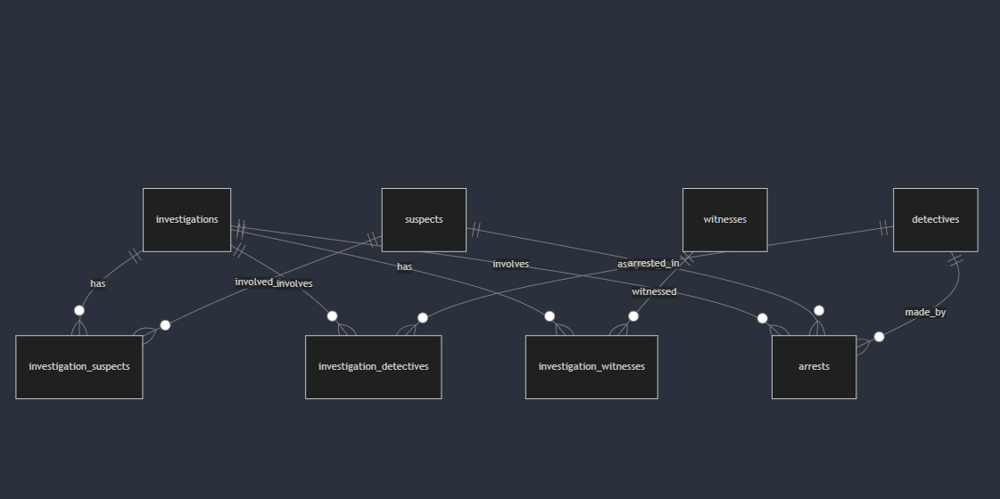

# Design Document

Tyler Meyers

Video overview: <https://www.youtube.com/watch?v=KRUvk-7ldGE>

## Scope

In this section you should answer the following questions:

* What is the purpose of your database?
To track the various elements related to an investigation.
* Which people, places, things, etc. are you including in the scope of your database?
This includes an investigation related to a crime, suspects, witnesses, detectives, arrests and the relationships between them all.
* Which people, places, things, etc. are *outside* the scope of your database?
A comprehensive investigation database could include hundreds more of tables. It could include evidence, forensic teams, etc..

## Functional Requirements

In this section you should answer the following questions:

* What should a user be able to do with your database?
The user should be able to track the most basic elements of an investigation (mainly the type of crime, who is involved, and the corresponding arrest record).
* What's beyond the scope of what a user should be able to do with your database?
The user is limited to the tables in place. As mentioned before, a complete investigation database would include dozens more of tables to keep track of everything/everyone involved.

## Representation

### Entities

In this section you should answer the following questions:

* Which entities will you choose to represent in your database?
For the police investigation database, the entities (tables) are:

Investigations: Represents ongoing and past crime investigations.
Suspects: Individuals suspected of involvement in a crime.
Detectives: Law enforcement officers assigned to investigations.
Witnesses: People who witnessed the crime or provided statements.
Arrests: Tracks information about arrests made during investigations.
Investigation-Suspects: Connects suspects to investigations (many-to-many relationship).
Investigation-Detectives: Connects detectives to investigations (many-to-many relationship).
Investigation-Witnesses: Connects witnesses to investigations (many-to-many relationship).

* What attributes will those entities have?
Each entity has an ID. For the tables related to people, they include names and relevant data to the investigation. For investigations and arrests it includes the people involved and the relavant information. For the relationship tables, it includes foreign keys.

* Why did you choose the types you did?
Primary keys (INTEGER): For efficient indexing and uniqueness.
Textual fields (TEXT): For storing names, descriptions, and other text-based data (e.g., names, crime descriptions, charges).
Timestamps and dates (TIMESTAMP, DATE): To track time-based events like crime dates, birthdates, and arrest dates.
Booleans (INTEGER with CHECK): For binary options (e.g., ongoing investigation or not) with 0 as false and 1 as true.
Foreign Keys: Used to establish relationships between the main tables and many-to-many join tables to maintain referential integrity.

* Why did you choose the constraints you did?
Primary Keys: Ensure each record in a table is unique.
Foreign Keys: Ensure integrity between related tables (e.g., ensuring that every arrest corresponds to a valid investigation, suspect, and detective).
Unique Constraints: To enforce uniqueness in attributes like badge_number to avoid duplication of key identifiers for detectives.
Check Constraints: Used to restrict values in fields like crime_type and gender to predefined options, ensuring data consistency.

### Relationships

In this section you should include your entity relationship diagram and describe the relationships between the entities in your database.

## Optimizations

In this section you should answer the following questions:

* Which optimizations (e.g., indexes, views) did you create? Why?
1. Indexes
Primary Keys: Each table has a primary key (id for investigations, suspects, detectives, witnesses, arrests, etc.), ensuring fast access and uniqueness for records.
Foreign Keys: Foreign key fields in tables like arrests, investigation_suspects, investigation_detectives, and investigation_witnesses help maintain referential integrity and optimize join operations.
Unique Index on badge_number: To ensure that no two detectives can have the same badge number, which improves lookup efficiency when searching by this field.
2. Views
Arrests List View: A view combining data from multiple tables (arrests, investigations, suspects, and detectives) simplifies querying for arrest-related information, providing a convenient way to access related data without complex joins in every query.

## Limitations

In this section you should answer the following questions:

* What are the limitations of your design?
Fixed Crime Types: The crime_type field is limited to predefined values, which may not accommodate emerging or unique crime categories without altering the database structure.
Single Role Assignment: The current structure allows only one role per suspect or detective in an investigation. If an individual has multiple roles, such as a detective who is also a suspect, it cannot be represented without modifying the design.
Limited Attributes for Certain Entities: Some entities like suspects or witnesses may require additional attributes (e.g., addresses, phone numbers) that are not included in the current design.

* What might your database not be able to represent very well?
Complex Relationships: The design does not handle complex relationships well, such as multiple witnesses providing conflicting statements or suspects with overlapping criminal histories.
Temporal Changes: The database may struggle to represent changes over time, such as the progression of investigations or updates to suspect statuses without extensive auditing or additional tables.
Dynamic Data Needs: If new data points become relevant (e.g., new types of evidence), the existing schema may not adapt without significant restructuring, limiting flexibility.
